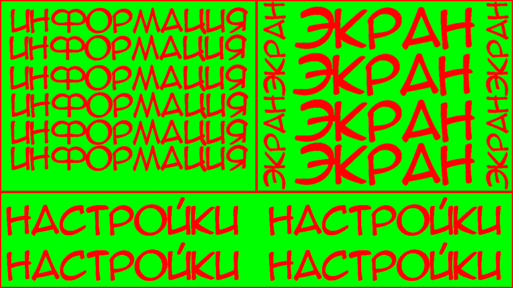

<h1>Описание интерфейса</h1>

<h2>Общее описание</h2>

 Стандартное разрешение экрана - 1280 на 720 
 Разрешение задается в специальном .cfg файле 

 Интерфейс клиента состоит из трех элементов:  
<ul> 
  <li>Экран - в правом верхнем углу экрана, прямоугольник 640 на 480</li>
  <li>Информация от мозга - в левом верхнем углу, прямоугольник 540 на 480</li>
  <li>Панель настроек - снизу, прямойгольник 1280 на 240</li>
</ul>

Рис. Макет интерфейса

<h2>Модуль экрана</h2>
 На экран выводится картинка с камеры, обработанная мозгом 

<h2>Модуль информации</h2>
 На модуль информации выводится дата, время, адрес камеры, fps, количество людей на экране, наличие разыскиваемых и тп 

<h2>Панель настроек (Панель управления)</h2>
 На панели настроек располагаются различные элементы управления 
 Такие как: переключение между камерами, переключатель режима слайд-шоу, ярлык базы данных и тп 
 Примерный размер каждого органа управления - 256 на 80 

